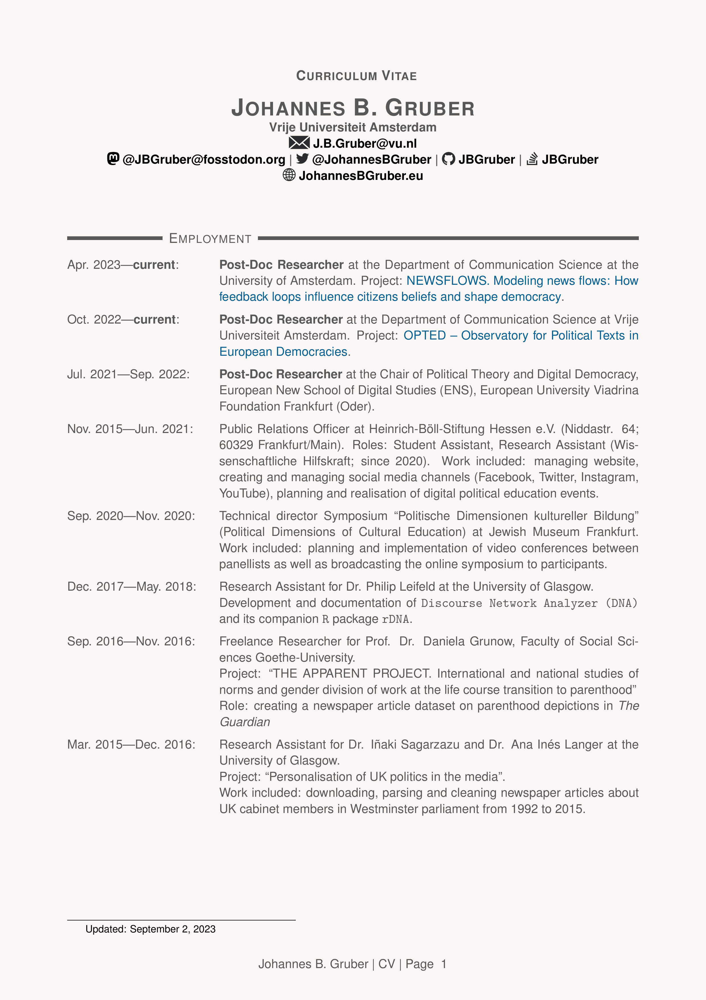
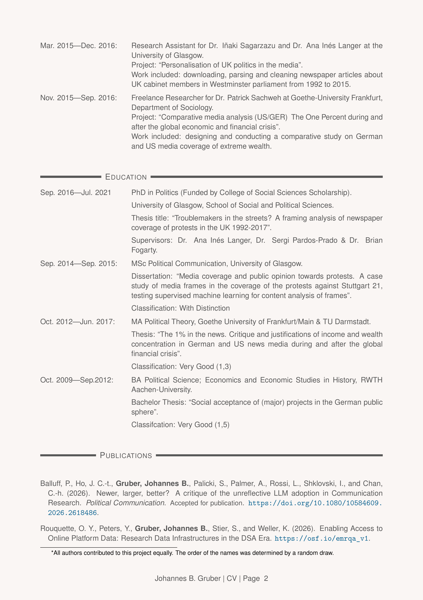
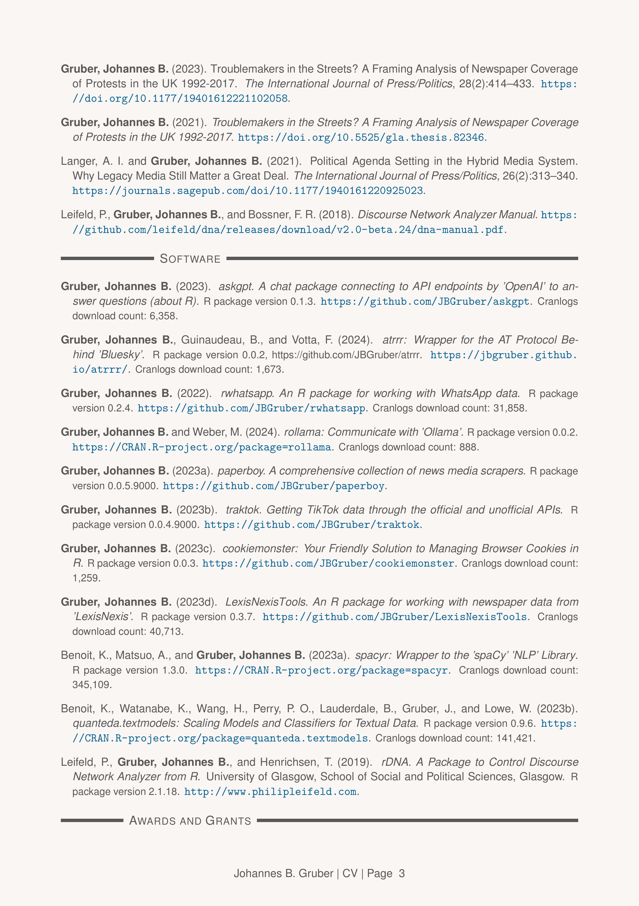

# Curriculum-Vitae

[Download the PDF version](pdf_version/CV_JohannesGruber.pdf).

------------------------------------------------------------------------



Compile from `R` with:

``` r
source("make.R")
```

Or via GNU Make:

``` bash
make compile
```
